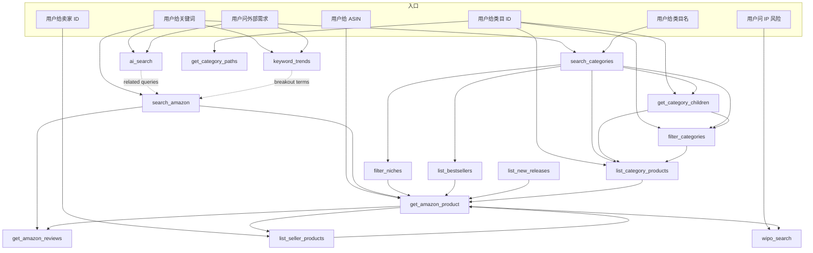

# Pangolinfo MCP — Tools Map

> 给 AI Agent 和工程师同时看的工具协同图。
> Live：19（18 业务 + 1 自省 `pangolinfo_capabilities`）。

## 🚀 给 AI 的快速入口

**第一次连上本 MCP 时**：先调 `pangolinfo_capabilities`（0 积点，本地数据）拿到工具清单 + 协同链路 + 使用提示。然后根据用户意图选 workflow。

```jsonc
// 推荐的首个调用
{ "name": "pangolinfo_capabilities", "arguments": { "detail": "summary" } }
```

## 工具按业务域分组

### 🛒 Amazon 抓取（9）
| Tool | 一句话 | 必填 | 成本 |
|---|---|---|---|
| `search_amazon` | 关键词 SERP 首屏 ASIN 列表 | `keyword` | 1pt / ~5s |
| `get_amazon_product` | 按 ASIN 抓单品完整 PDP | `asin` | 1pt / ~5s |
| `get_amazon_reviews` | 按 ASIN 翻页拉真实评论 | `asin` | **5pt/页** / ~10s |
| `list_bestsellers` | 类目热销榜 Top-50 + 24h 变化 | `categorySlug` | 1pt / ~5s |
| `list_new_releases` | 类目新品榜 Top-50（30 天） | `categorySlug` | 1pt / ~5s |
| `list_seller_products` | 卖家店铺全部商品 | `sellerId` | 1pt / ~5s |
| `list_category_products` | 类目下具体商品分页 | `nodeId` | 1pt / ~5s |
| `scrape_url` | 高级逃生口:content 零件或完整 url + parserName 抓非标准页 | `parserName` + (`content` 或 `url`) | 1pt / ~5s |
| `search_amazon_alexa` | 自然语言问 Amazon Rufus AI 拿分组推荐 | `prompts[]` | **6pt/次** / ~30s |

### 🧭 Amazon 利基数据（5）
| Tool | 一句话 | 必填 | 成本 |
|---|---|---|---|
| `search_categories` | 关键词搜类目树 | `keyword` | 1pt / ~3s |
| `get_category_children` | 类目下钻列子类目 | (无) | 1pt / ~3s |
| `filter_categories` | 30+ 指标筛/详情类目 | `timeRange`, `sampleScope` | 1pt / ~5s |
| `filter_niches` | 50+ 指标筛/详情 niche | (无) | 1pt / ~5s |
| `get_category_paths` | 批量解析 ID → 面包屑 | `categoryIds[]` | 1pt / ~2s |

### 🌐 Google 系（3）
| Tool | 一句话 | 必填 | 成本 |
|---|---|---|---|
| `search_local_maps` | Maps 本地商家 | `query`, `latitude`, `longitude` | 1.5pt / ~5s |
| `ai_search` | SERP + AI Overview | `query` | 2pt / ~30s |
| `keyword_trends` | 关键词热度对比 | `keywords[]` | 1.5pt / ~5s |

### ⚖️ IP（1）
| Tool | 一句话 | 必填 | 成本 |
|---|---|---|---|
| `wipo_search` | WIPO 全球外观设计/商标;`enableLitigation=true` 联动美国专利诉讼(原 `pacer_search` 能力) | `source` | 2pt / ~5s（+12 当 `enableLitigation` 查到专利） |

### 🤖 自省（1）
| Tool | 一句话 | 必填 | 成本 |
|---|---|---|---|
| `pangolinfo_capabilities` | 自省 — 工具清单 + 协同链路 | (无) | 0pt（本地） |

## 协同链路（mermaid 图）



## 经典 Workflow

### 🔍 WF1: 从 0 到 1 选品（GTM 漏斗）
```
search_categories               # 关键词 → 类目 ID
  ↓ browseNodeId
filter_niches                   # 按指标筛蓝海 niche
  ↓ nicheId
filter_niches                   # 再调一次，取单 niche 深度报告
  ↓ referenceAsinImageUrl
list_category_products          # 看真实在售商品
  ↓ asin
get_amazon_product              # 拆单品 PDP
  ↓
get_amazon_reviews              # 挖 VOC 痛点（filterByStar='critical'）
  ↓
wipo_search                     # 立项前外观专利 / 商标排查
```

### 🥊 WF2: 单 ASIN 竞品深拆
```
search_amazon                   # 关键词找候选 ASIN
  ↓ asin
get_amazon_product              # PDP 详情
  ↓
get_amazon_reviews              # 挖痛点
  ↓ seller.id
list_seller_products            # 看卖家全部铺货
```

### 📈 WF3: 类目趋势监测
```
list_bestsellers                # 长青龙头
list_new_releases               # 新进黑马
keyword_trends                   # 外部需求方向
```

### 🌐 WF4: 外部需求验证
```
keyword_trends                   # 看热度走势
  ↓ rising / breakout 词
ai_search (mode='overview')  # 看 AI Overview 引用了什么源
  ↓ related searches
search_amazon                   # 反向看 Amazon 内有没有对应商品
```

### ⚖️ WF5: IP 立项前排查
```
wipo_search source='USID' hol='<brand>'              # 看竞品在美国的外观专利
wipo_search source='CNID' prod='<product>' rd='2024' # 看中国的（必须 narrow）
wipo_search source='HAGUE' irn='DM/000298'           # 精确国际注册号
```

### ⚖️ WF5b: 专利侵权诉讼闭环（一次调用）
```
wipo_search source='USID' prod='<product>' enableLitigation=true
  # 命中专利后自动用专利号联动查美国诉讼（底层 PACER），
  # 每条命中专利直接带 litigationStatus / caseTotal / cases[]（案件进展、原被告、docket 流水）。
  # 仅查到专利才 +12 积点。
```
注：原独立 `pacer_search` 工具于 2026-06 退役，诉讼能力并入此 `enableLitigation` 参数。

### 🏪 WF6: 卖家/品牌画像
```
get_amazon_product              # 任何一个已知 ASIN
  ↓ seller.id
list_seller_products            # 该 seller 的所有商品
```

## 字段依赖（"我的输出能喂给谁"）

| 上游 tool | 关键输出字段 | 可以喂给 |
|---|---|---|
| `search_amazon` | `results[].asin` | `get_amazon_product`, `get_amazon_reviews` |
| `get_amazon_product` | `asin`, `seller.id`, `category_id`, `parentAsin` | `get_amazon_reviews`, `list_seller_products`, `wipo_search`(brand), `filter_categories` |
| `search_categories` | `browseNodeId`, `browseNodeIdPath` | `get_category_children`, `list_category_products`, `filter_categories`, `filter_niches` |
| `get_category_children` | `browseNodeIdPath` | 喂回自己继续下钻 / `list_category_products` / `filter_categories` |
| `filter_niches` | `nicheId`, `referenceAsinImageUrl` | `filter_niches` (detail), `get_amazon_product` (从 referenceAsin) |
| `filter_categories` | `categoryId` | `list_category_products`, `get_category_paths`, `list_bestsellers` (slug 推导) |
| `list_bestsellers` / `list_new_releases` | `recsList[].id` (ASIN) | `get_amazon_product` |
| `list_category_products` / `list_seller_products` | `results[].asin` | `get_amazon_product`, `get_amazon_reviews` |
| `keyword_trends` | `keywordsRankData[].rankList[]` (breakout terms) | `search_amazon`, `ai_search` |
| `ai_search` | `ai_overview.references[].url`, `organic[].url` | (人类阅读为主) |

## 成本对照

| 价位 | 工具 |
|---|---|
| **免费** | `pangolinfo_capabilities` |
| **1 pt** | `search_amazon`, `get_amazon_product`, `list_bestsellers`, `list_new_releases`, `list_seller_products`, `list_category_products`, `search_categories`, `get_category_children`, `get_category_paths`, `filter_categories`, `filter_niches` |
| **1.5 pt** | `search_local_maps`, `keyword_trends` |
| **2 pt** | `ai_search`, `wipo_search`（+12 当 `enableLitigation` 查到专利）|
| **5 pt/页** ⚠️ | `get_amazon_reviews` |

**预算建议**：跑一次 WF1（从 0 选品）保守估计 5-10 pt；加 reviews 挖痛点 +10-30 pt；带 wipo 排查 +2-4 pt。

## 边界（CONTRACT §9）

MCP **故意不暴露**以下能力（属于商业 / 安全敏感操作）：
- `/user/*`、`/usercenter/*` — 账号管理
- `/setmeal/*`、`/incremental/*`、`/order/*` — 订阅、订单
- `/email/*` — 邮件验证码、订阅
- `/crawler/task/*` — 任务管理写操作
- `/user/permanent-token/*` — Key 管理

**AI 不要询问账号余额、积分剩余、订阅状态**——这些由用户在 pangolinfo.com 自助管理。

## 错误码语义

| Code | 含义 | AI 该做什么 |
|---|---|---|
| `AUTH` | API Key 无效 | 提示用户重跑 installer 或检查 `~/.pangolinfo/config.json`，不要重试 |
| `QUOTA` | 配额不足 | 提示用户去 pangolinfo.com 升级，停止本次链路 |
| `RATE_LIMIT` | 频率超限 | 短暂等待后重试一次 |
| `BAD_INPUT` | 参数错（含 zod 校验失败） | 看错误明细修正参数后重试 |
| `SERVER` | 服务端 5xx | 重试 1 次；仍失败则告知用户跳过本步 |
| `NETWORK` | 本地网络问题 | 提示用户检查网络，不重试 |

## 协议层信息

- **MCP 协议版本**：2024-11-05
- **传输**：stdio JSON-RPC（一行一消息）
- **server.name**：`pangolinfo-mcp`
- **server.version**：`0.6.3`
- **capabilities**：`tools` only（暂不支持 `prompts` / `resources`）

## 相关文档

- 接口契约：`CONTRACT.md`、`CONTRACT-tools.md`、`CONTRACT-i18n.md`、`CONTRACT-installer.md`
- AI 友好度复盘：`REVIEW-ai-friendliness.md`
- 已知风险：`RISKS.md`
